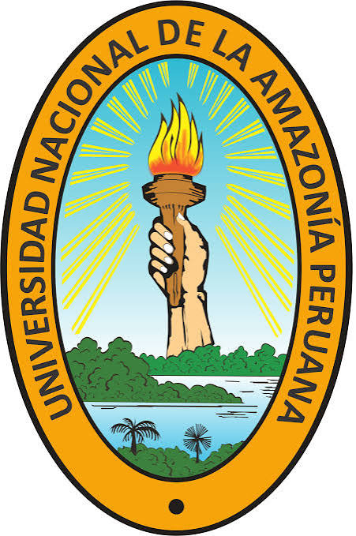

# About the author {.unnumbered}

## J. David Urquiza Muñoz {-}

<a href="https://www.bgc-jena.mpg.de/person/121817/2206" style="font-weight: bold; color: #0e75b6; text-decoration: none;">David Urquiza</a> is a tropical forest ecologist, a researcher at the Max Planck Institute for Biogeochemistry, and an associate professor at the Forestry Science Faculty of the Universidad Nacional de la Amazonía Peruana (UNAP). His research in geospatial ecology and remote sensing focuses on integrating field-based and remotely sensed data to understand spatio-temporal changes in forest attributes across the northwestern Amazon.

<!-- Max Planck Section -->

<b>Max Planck Institute for Biogeochemistry</b> 
<i>Department of Biogeochemical Processes</i> 
Jena 07745, Germany &bull; <a href="mailto:jurquiza@bgc-jena.mpg.de" style="color: #0e75b6; text-decoration: none;">jurquiza@bgc-jena.mpg.de</a>

<!-- UNAP Section -->

<b>Universidad Nacional de la Amazonía Peruana (UNAP)</b> 
<i>Facultad de Ciencias Forestales &bull; VETAF Research Group</i> 
Iquitos 16600, Peru &bull; <a href="mailto:david.urquiza@unapiquitos.edu.pe" style="color: #0e75b6; text-decoration: none;">david.urquiza@unapiquitos.edu.pe</a>

<!-- Profile Picture -->

 

### **For more information about the author, visit his personal website:** {-} 
### *[https://jdurquizam.github.io/](https://jdurquizam.github.io/)* {-}